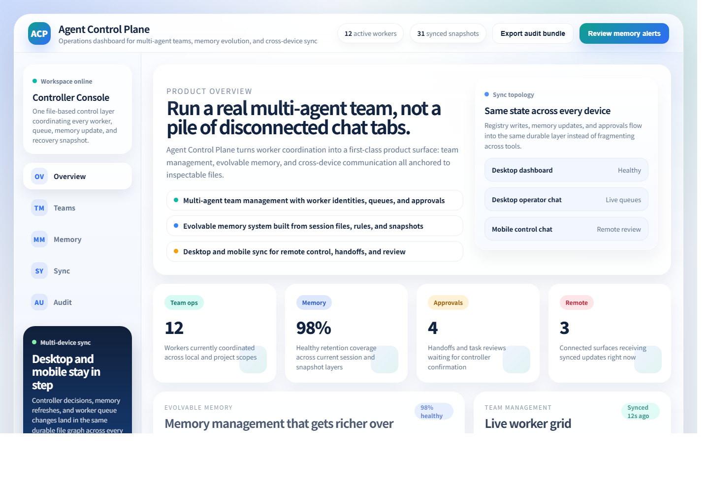
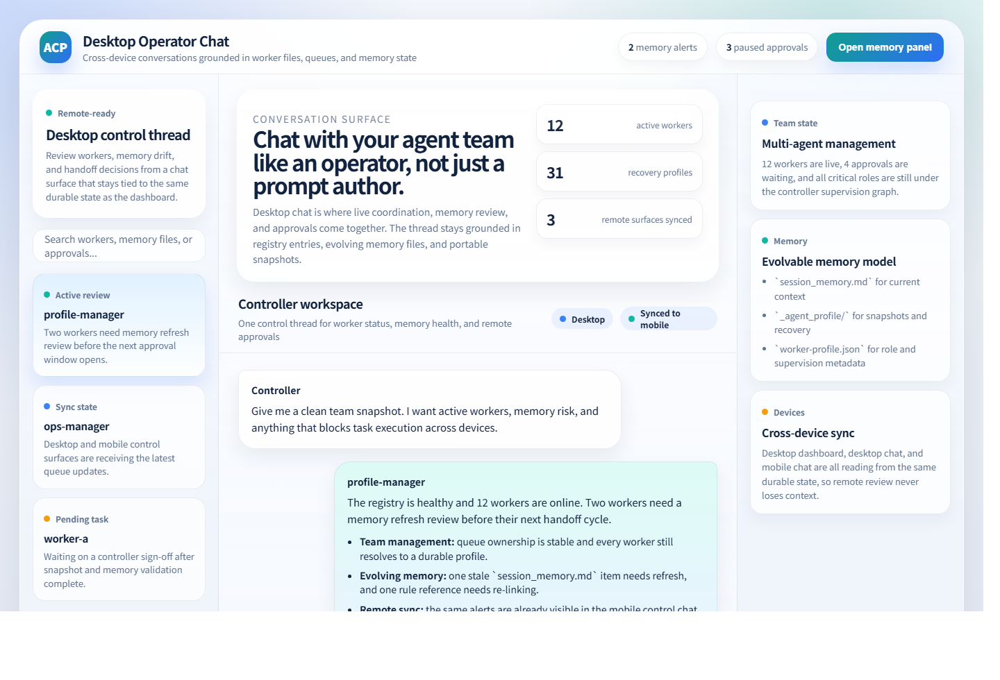
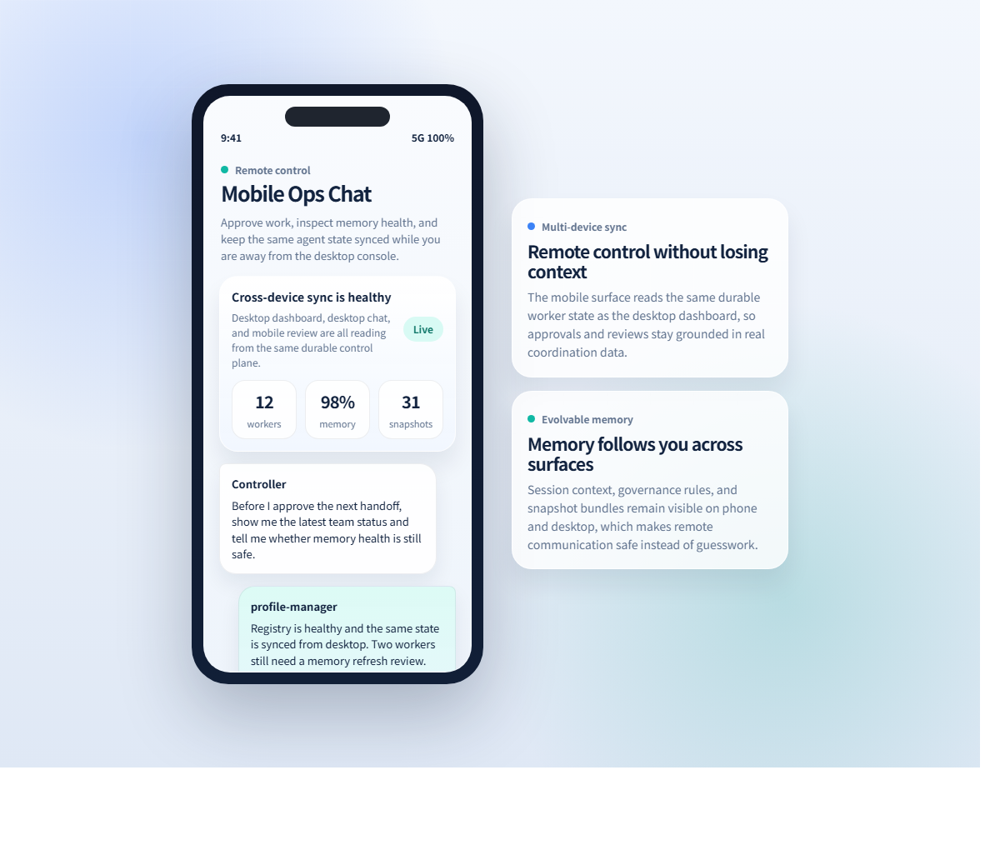

# Agent Control Plane

[English](./README.md) | [简体中文](./README.zh-CN.md)

The coordination layer for teams running multiple local AI agents, with strong team management, evolvable memory, and cross-device control.

Prompts are not the hard part. The hard part is everything around them:

- stable worker identity
- clear handoffs
- durable memory
- audit-friendly task flow
- recovery after context loss
- moving workers across machines without rebuilding everything from scratch

Agent Control Plane is a lightweight, file-based framework for solving those problems without adding another heavy backend.

<p align="center">
  
</p>

<p align="center">
  
</p>

<p align="center">
  
</p>

> These screenshots are captured from high-fidelity static prototypes layered on top of the current file-based core: a controller dashboard, a desktop operations chat, a memory management panel, and a mobile control chat.

## Why It Stands Out

### 1. Multi-Agent Team Management

This project treats agents as a real operating team instead of isolated chat sessions.

- explicit worker identities and roles
- discoverable worker registry
- queue and handoff visibility
- portable supervision structure across local and project scopes

### 2. Evolvable Memory Management

Memory is designed to grow, recover, and adapt over time rather than disappear when chat context resets.

- session memory for live working context
- rule-linked governance material
- portable `_agent_profile` snapshots
- durable audit and recovery paths

### 3. Cross-Device Sync And Remote Communication

The same control plane can power desktop dashboards, desktop chat, and mobile operator review.

- one durable state model across devices
- mobile-friendly remote approvals and status checks
- synchronized memory and handoff review
- safer communication when you are away from the main workstation

## What You Get

- Worker body directories with explicit identity, memory, status, and communication files
- A generated worker registry built from `worker-profile.json` files
- Portable `_agent_profile` snapshots for migration, recovery, and audit
- Project-level worker bodies plus subordinate workers
- Plain-text coordination that is easy to diff, inspect, and automate
- A built-in memory management model based on durable worker files rather than volatile chat context
- A clean path to desktop dashboards, desktop chat, and mobile control surfaces without changing the underlying data model

## Product Pillars

### 1. Multi-Agent Team Management

The system is designed to support a dense controller view for real team operations:

- active workers
- task queues
- handoff states
- supervision structure
- snapshot coverage

### 2. Evolvable Memory Management System

Memory is a first-class system, not an afterthought.

Agent Control Plane already organizes memory through:

- `memory/session_memory.md`
- governance-linked rules and references
- `_agent_profile` snapshots
- portable audit and recovery files

That makes it possible to build:

- memory review panels
- retention health checks
- worker recovery workflows
- role-specific memory surfaces

### 3. Cross-Device Sync And Mobile Communication

The long-term product direction includes synchronized operator surfaces for:

- desktop dashboards
- desktop operator chat
- mobile status checks
- mobile approvals and alerts
- remote handoff review on the go

## Who This Is For

- teams running multiple coding agents locally
- maintainers who want auditable, file-based agent operations
- researchers and builders who need reproducible worker setups
- anyone tired of losing coordination state inside chat history

## Why This Project Exists

Most multi-agent setups fail in boring ways:

- a worker exists only as a chat tab
- nobody knows which files define the worker
- handoffs live in memory instead of durable records
- migration means rebuilding prompts, context, and rules by hand

This project treats worker operations like infrastructure:

- identity is explicit
- memory is stored in files
- governance is inspectable
- snapshots are portable

## Why File-Based Memory Wins

Most agent systems lose useful memory because it is trapped inside tool sessions.

This project pushes memory into durable, inspectable artifacts:

- session memory for current working context
- governance references for durable rules
- snapshots for migration and recovery
- registry entries for role and supervision metadata

That gives you something rare in agent tooling: a real memory management system with clean interfaces and clear ownership.

## Quick Start

### 1. Create an environment

```powershell
python -m venv .venv
.venv\Scripts\python -m pip install -e .
```

### 2. Build the worker registry

```powershell
.venv\Scripts\agent-control-plane sync-registry `
  --coord-root coordination `
  --workers-root examples/local-workers `
  --scan-root examples/projects
```

### 3. Generate portable worker profiles

```powershell
.venv\Scripts\agent-control-plane snapshot-profiles `
  --coord-root coordination `
  --workers-root examples/local-workers `
  --scan-root examples/projects
```

### 4. Inspect the results

- `coordination/registry.json` will contain the discovered workers
- each example worker body will gain an `_agent_profile/` snapshot layer

## Example Layout

```text
agent-control-plane-oss/
  coordination/
    registry.json
    prompts/
  examples/
    local-workers/
    projects/
  src/
    agent_control_plane/
  templates/
  tests/
```

Example worker body:

```text
worker-body/
  worker-profile.json
  status/
    controller-link.md
  memory/
    session_memory.md
  inbox/
  outbox/
  reports/
  _agent_profile/
```

## Commands

- `agent-control-plane sync-registry`
  Discover workers and regenerate the shared registry

- `agent-control-plane snapshot-profiles`
  Build portable `_agent_profile` snapshots from worker body files

## UI Direction

The current repository ships the backend scaffolding for a richer product surface.

Planned interface layers include:

- a desktop operations dashboard
- a desktop operator chat
- a memory management center
- a mobile operator chat
- cross-device sync views
- task and approval panels

The screenshots above come from high-fidelity static prototypes, while the code in this repository already implements the durable coordination model underneath them.

## Design Principles

- Files first
  Coordination should survive chat resets and tool changes.

- Lightweight bodies
  Worker bodies should store governance material, not become project junk drawers.

- Generated registries
  Do not hand-edit worker registries when the source of truth is already the worker profile.

- Portable snapshots
  Recovery and migration should be routine, not heroic.

## Generic Role Names

The example workspace intentionally uses neutral role names:

- `controller`
- `profile-manager`
- `ops-manager`
- `worker-a`
- `worker-b`

You can swap these for your own naming scheme after cloning.

## Documentation

- [Architecture](./docs/architecture.md)
- [Worker Profile](./docs/worker-profile.md)
- [Governance Model](./docs/governance.md)
- [Contributing](./CONTRIBUTING.md)
- [Security Policy](./SECURITY.md)

## Project Status

`v0.1.0` is the first public scaffold release.

It already includes:

- a usable CLI
- example worker bodies
- registry generation
- profile snapshot generation
- tests and CI
- a durable memory management model
- a visual direction for desktop and mobile control surfaces
- a product story centered on team management, evolvable memory, and remote communication

The next wave is likely to focus on:

- richer validation
- task/result file helpers
- a real management dashboard
- a mobile control page and chat UI
- stronger schema tooling

## License

MIT
